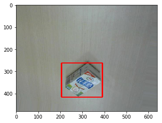
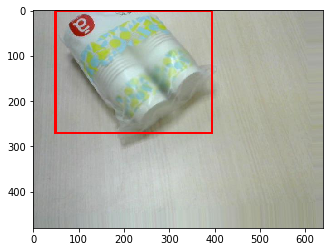
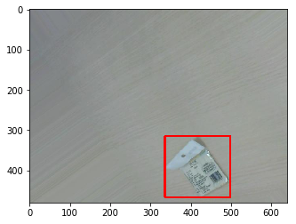
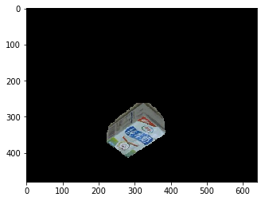
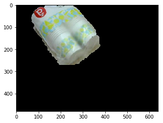
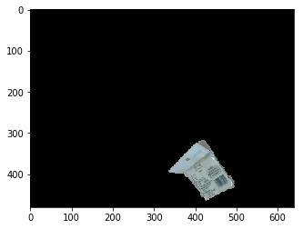
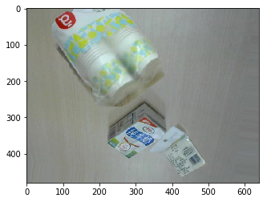

# Data-Augmentaion-for-multi-object-detection
Data Augmentaion for multi-object detection using single object image

通过单对象图像来生成多对象图像的数据增强方法。

## Motivation

1. 通过将多个单张图的object区域进行组合，以一张图为背景。

2. object区域通过Grabcut分割得到。

3. Grabcut需要输入object bounding box。这里的bounding box可以设置为图像外边界内移几个像素，但是这样得出的分割结果不理想。

    我们这里的bounding box 通过预训练的模型[detecion 模型](https://github.com/matterport/Mask_RCNN)来得到。 直接选取概率最大的框，而不管其框的类别。 

   可以发现，框的检测能力已经可以通过在公开数据集上训练得到。所以在新的数据集上，是否可以不训练框的回归，只训练分类？这个想法也催生了我的一个工作[Product Dection](https://github.com/huzhengwei/Product-Detecion).


## Usage

### 1. 为single object生成mask

```
python Grabcut_train_mask_gen.py
```

### 2. 根据mask 组合多个object

```
Product_image_merge.ipynb
```

## 效果

**1.原图+预训练模型预测框**

  


**2.Grabcut 分割mask**

  


**3.融合结果**

<

## 相关Paper

1. [基于改进 Faster RCNN 与 Grabcut 的商品图像检测](http://www.c-s-a.org.cn/csa/ch/reader/create_pdf.aspx?file_no=6631&flag=1&year_id=2018&quarter_id=11)

## Other augmentation method

1. [facebook的 mixup方法实现](https://github.com/facebookresearch/mixup-cifar10)
2. [Amazon: Bag of Freebies for Training Object Detection Neural Networks](https://arxiv.org/abs/1902.04103?context=cs.CV)
